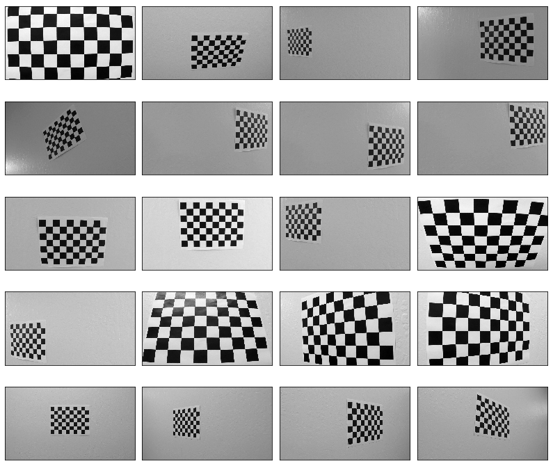
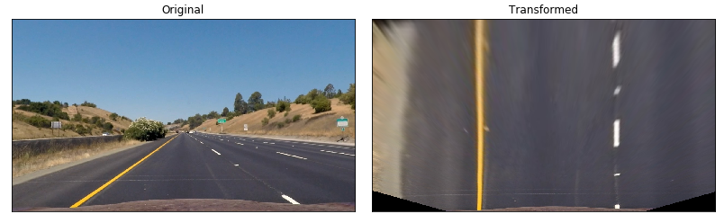
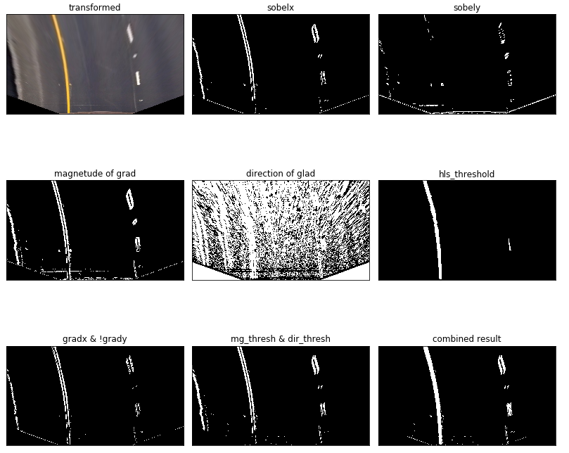
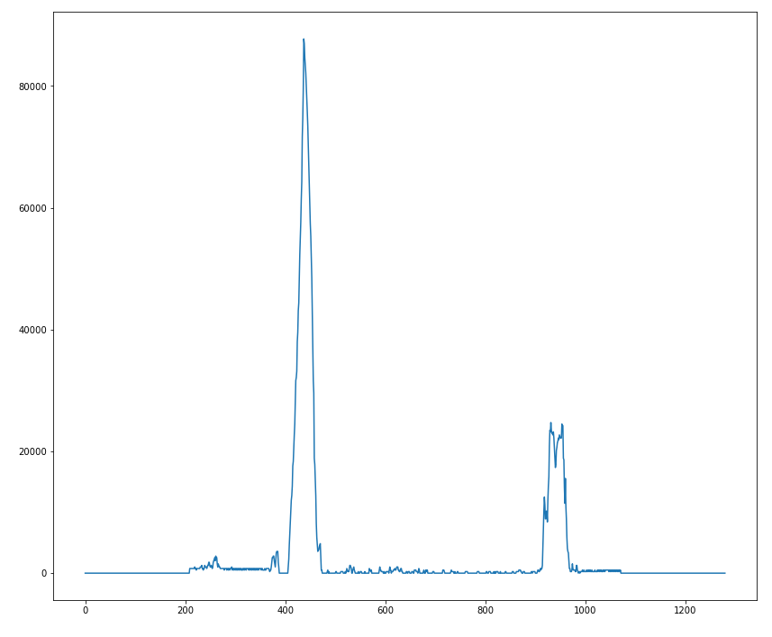

# Project 04 - Advanced Lane Finding
[](http://www.udacity.com/drive)

The goals / steps of this project are the following:

* Compute the camera calibration matrix and distortion coefficients given a set of chessboard images.
* Apply a distortion correction to raw images.
* Use color transforms, gradients, etc., to create a thresholded binary image.
* Apply a perspective transform to rectify binary image ("birds-eye view").
* Detect lane pixels and fit to find the lane boundary.
* Determine the curvature of the lane and vehicle position with respect to center.
* Warp the detected lane boundaries back onto the original image.
* Output visual display of the lane boundaries and numerical estimation of lane curvature and vehicle position.

[//]: # (Image References)

[image1]: ./examples/undistort_output.png "Undistorted"
[image2]: ./test_images/test1.jpg "Road Transformed"
[image3]: ./examples/binary_combo_example.jpg "Binary Example"
[image4]: ./examples/warped_straight_lines.jpg "Warp Example"
[image5]: ./examples/color_fit_lines.jpg "Fit Visual"
[image6]: ./examples/example_output.jpg "Output"
[video1]: ./project_video.mp4 "Video"

## [Rubric](https://review.udacity.com/#!/rubrics/571/view) Points

### Camera Calibration

The calibration is performed using chessboard pattern images taken using the same camera as the project videos, such as the one shown below:



#### 1. Calibration Matrix

The code for this step is contained in the first code cell of the IPython notebook located in "./AdvanceLaneFinding.ipynb").  

I start by preparing "object points", which will be the (x, y, z) coordinates of the chessboard corners in the world. Here I am assuming the chessboard is fixed on the (x, y) plane at z=0, such that the object points are the same for each calibration image.  Thus, `objp` is just a replicated array of coordinates, and `objpoints` will be appended with a copy of it every time I successfully detect all chessboard corners in a test image.  `imgpoints` will be appended with the (x, y) pixel position of each of the corners in the image plane with each successful chessboard detection.  

I then used the output `objpoints` and `imgpoints` to compute the camera calibration and distortion coefficients using the `cv2.calibrateCamera()` function.  I applied this distortion correction to the test image using the `cv2.undistort()` function and obtained this result: 


### Pipeline (single images)

#### 1. Perspective transform

The code for my perspective transform includes a function called `warp_camera()`, which appears in lines 60 through 68 in the file `p2.py` 
The `warp_camera()` function takes as inputs an image (`img`). I chose the hardcode the camera matrix:

```python
self.dist = np.array([[-0.24688507, -0.02373154, -0.00109831, 0.00035107,   -0.00259869]])
self.mtx = np.array([
    [  1.15777818e+03,   0.00000000e+00,   6.67113857e+02],
    [  0.00000000e+00,   1.15282217e+03,   3.86124583e+02],
    [  0.00000000e+00,   0.00000000e+00,   1.00000000e+00]])
self.camera_M = np.array([
    [-4.09514513e-01, -1.54251784e+00, 9.09522880e+02],
    [-3.55271368e-15, -1.95774942e+00, 8.94691487e+02],
    [-3.57786717e-18, -2.38211439e-03, 1.00000000e+00]])
```

This is result of the following source and destination points:

| Source        | Destination   | 
|:-------------:|:-------------:| 
| 190, 720      | 390, 720      | 
| 584, 457      | 390,  0       |
| 700, 457      | 926,  0       |
| 1126,720      | 926, 720      |

I verified that my perspective transform was working as expected by drawing the `src` and `dst` points onto a test image and its warped counterpart to verify that the lines appear parallel in the warped image.


#### 2. Binarization

I used a combination of color and gradient thresholds to generate a binary image (thresholding steps at lines 80-195 in `p2.py`).  
Here's an example of my output for this step.  (note: this is not actually from one of the test images)



#### 3. Lines detection

The first step in this method is to compute the base points of the lanes. This is done in the histogram_base_points function in lines 370 - 376 of p2.py or in the . The first step is to compute a histogram of the lower half of the thresholded image. The histogram corresponding to the thresholded, warped image in the previous section is shown below:




#### 5. Describe how (and identify where in your code) you calculated the radius of curvature of the lane and the position of the vehicle with respect to center.

I did this in lines # through # in my code in `my_other_file.py`

#### 6. Provide an example image of your result plotted back down onto the road such that the lane area is identified clearly.

I implemented this step in lines # through # in my code in `yet_another_file.py` in the function `map_lane()`.  Here is an example of my result on a test image:

![alt text][image6]

---

### Pipeline (video)

#### 1. Provide a link to your final video output.  Your pipeline should perform reasonably well on the entire project video (wobbly lines are ok but no catastrophic failures that would cause the car to drive off the road!).

Here's a [link to my video result](./project_video.mp4)

---

### Discussion

#### 1. Briefly discuss any problems / issues you faced in your implementation of this project.  Where will your pipeline likely fail?  What could you do to make it more robust?

Here I'll talk about the approach I took, what techniques I used, what worked and why, where the pipeline might fail and how I might improve it if I were going to pursue this project further.  
