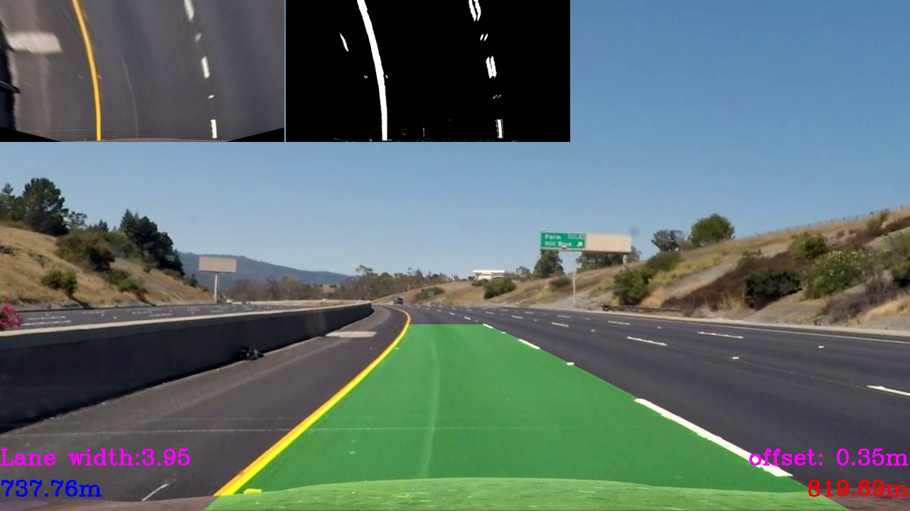
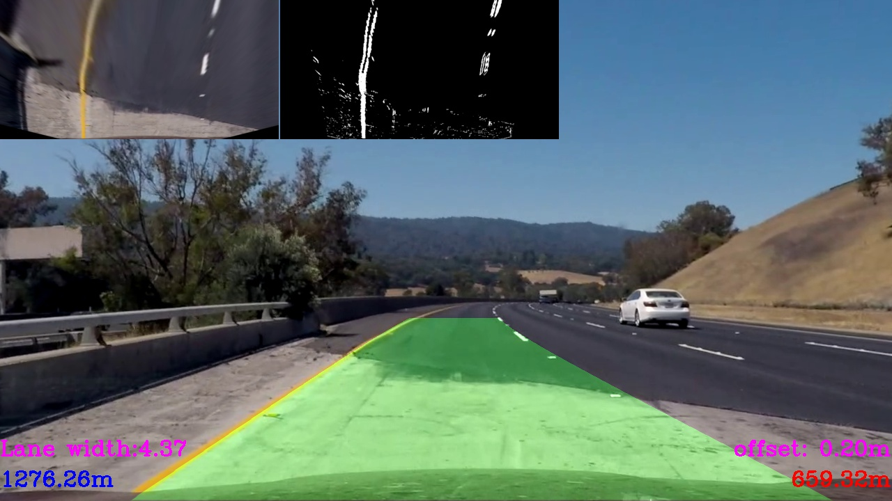
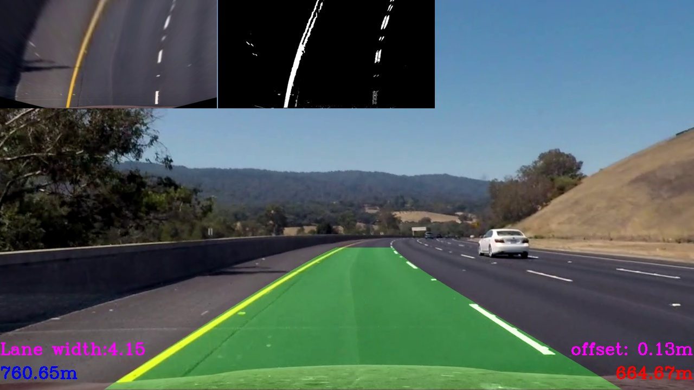

# Project 04 - Advanced Lane Finding
[](http://www.udacity.com/drive)

The goals / steps of this project are the following:

* Compute the camera calibration matrix and distortion coefficients given a set of chessboard images.
* Apply a distortion correction to raw images.
* Use color transforms, gradients, etc., to create a thresholded binary image.
* Apply a perspective transform to rectify binary image ("birds-eye view").
* Detect lane pixels and fit to find the lane boundary.
* Determine the curvature of the lane and vehicle position with respect to center.
* Warp the detected lane boundaries back onto the original image.
* Output visual display of the lane boundaries and numerical estimation of lane curvature and vehicle position.

[//]: # (Image References)

[image1]: ./examples/undistort_output.png "Undistorted"
[image2]: ./test_images/test1.jpg "Road Transformed"
[image3]: ./examples/binary_combo_example.jpg "Binary Example"
[image4]: ./examples/warped_straight_lines.jpg "Warp Example"
[image5]: ./examples/color_fit_lines.jpg "Fit Visual"
[image6]: ./examples/example_output.jpg "Output"
[video1]: ./project_video.mp4 "Video"

## [Rubric](https://review.udacity.com/#!/rubrics/571/view) Points

### Camera Calibration

The calibration is performed using chessboard pattern images taken using the same camera as the project videos, such as the one shown below:


#### 1. Calibration Matrix

The code for this step is contained in the first code cell of the IPython notebook located in "./AdvanceLaneFinding.ipynb").  

I start by preparing "object points", which will be the (x, y, z) coordinates of the chessboard corners in the world. Here I am assuming the chessboard is fixed on the (x, y) plane at z=0, such that the object points are the same for each calibration image.  Thus, `objp` is just a replicated array of coordinates, and `objpoints` will be appended with a copy of it every time I successfully detect all chessboard corners in a test image.  `imgpoints` will be appended with the (x, y) pixel position of each of the corners in the image plane with each successful chessboard detection.  

I then used the output `objpoints` and `imgpoints` to compute the camera calibration and distortion coefficients using the `cv2.calibrateCamera()` function.  I applied this distortion correction to the test image using the `cv2.undistort()` function and obtained this result: 


### Pipeline (single images)

#### 1. Perspective transform

The code for my perspective transform includes a function called `warp_camera()`, which appears in lines 60 through 68 in the file [p2.py](https://github.com/maslovw/SDND/blob/04364d341f09f3027bb1acb585cafefcc2ede14c/Advanced-Lane-Lines/p2.py#L60)
The `warp_camera()` function takes as inputs an image (`img`). I chose the hardcode the camera matrix:

```python
self.dist = np.array([[-0.24688507, -0.02373154, -0.00109831, 0.00035107,   -0.00259869]])
self.mtx = np.array([
    [  1.15777818e+03,   0.00000000e+00,   6.67113857e+02],
    [  0.00000000e+00,   1.15282217e+03,   3.86124583e+02],
    [  0.00000000e+00,   0.00000000e+00,   1.00000000e+00]])
self.camera_M = np.array([
    [-4.09514513e-01, -1.54251784e+00, 9.09522880e+02],
    [-3.55271368e-15, -1.95774942e+00, 8.94691487e+02],
    [-3.57786717e-18, -2.38211439e-03, 1.00000000e+00]])
```

This is result of the following source and destination points:

| Source        | Destination   | 
|:-------------:|:-------------:| 
| 190, 720      | 390, 720      | 
| 584, 457      | 390,  0       |
| 700, 457      | 926,  0       |
| 1126,720      | 926, 720      |

I verified that my perspective transform was working as expected by drawing the `src` and `dst` points onto a test image and its warped counterpart to verify that the lines appear parallel in the warped image.


#### 2. Binarization

I used a combination of color and gradient thresholds to generate a binary image (thresholding steps at lines 80-195 in `p2.py`).  
Here's an example of my output for this step.  (note: this is not actually from one of the test images)


#### 3. Lines detection

The first step in this method is to compute the base points of the lanes. This is done in the histogram_base_points function in lines 370 - 376 of [p2.py](https://github.com/maslovw/SDND/blob/04364d341f09f3027bb1acb585cafefcc2ede14c/Advanced-Lane-Lines/p2.py#L365) or in the AdvanceLaneFinding section 4.5. The first step is to compute a histogram of the lower half of the thresholded image. The histogram corresponding to the thresholded, warped image in the previous section is shown below:


Second step is to find all the pixels, that belongs to the left and right lines separately (AdvanceLaneFinding Section 5). I used simple Sliding windows as described in the lesson


The algorithm splits the image into a number of horizontal bands (10). Starting at the lowest band, a window of a fixed width (240 pixels) centered at both base points is considered. The x and y coordinates of all the nonzero pixels in these windows are compiled into into separate lists. The base point for the next band is assumed to be the column with the maximum number of pixels in the current band. After all the points are accumulated, the function reject_outliers is used to remove any points whose x or y coordinates are outside of two standard deviations from the mean value. This helps remove irrelevant pixels from the data.

The filtered pixels, along with a weighted average of prior lane pixels are used with np.polyfit to compute a second order polynomial that fits the points.

The polynomial is then used to create an image mask that describes a region of interest which is then used by the masking method in upcoming frames.

The sanity check is defined in the method Line._check_and_measure_curvative() in [p2.py](https://github.com/maslovw/SDND/blob/04364d341f09f3027bb1acb585cafefcc2ede14c/Advanced-Lane-Lines/p2.py#L313): lines 313-318 . It is called by the Line._find. The stored value of the radius of curvature of the lane is used to see if the current radius of curvature has deviated by more than 50%.

#### 5. Radius of curvature and vehicle position

The radius of curvature is computed in the `Line._measure_curvative` method in lines 299-311. The pixel values of the lane are scaled into meters using the scaling factors defined as follows:
```python
ym_per_pix = 30/720 # meters per pixel in y dimension
xm_per_pix = 3.7/700 # meteres per pixel in x dimension
```

These values are then used to compute the polynomial coefficients in meters and then the formula given in the lectures is used to compute the radius of curvature.

I approximated the coefficient, and got it equal to 0.327


The position of the vehicle is computed by the code in lines 439-444. The camera is assumed to be centered in the vehicle and checks how far the midpoint of the two lanes is from the center of the image.


```python

left_bx = np.average(left_fitx[-10:])
right_bx = np.average(right_fitx[-10:])
lane_mid = (right_bx - left_bx) / 2 + left_bx
veh_pos = image.shape[1]/2
dx = (veh_pos - middle)*xm_per_pix
```


#### 6. Result.

The pipeline itself:
```python
import p2
def process_image(image):
    ls = p2.LinesSearch(p2.ImageSobelHlsBinarizer())

    ls.search(image)
    ret = ls.plot()
    return ret
```
`ls.search` process each image and updates the values of left and right Line classes.

`ls.plot` draws the lane on picture, plus adds some additional 'debugging' data, like birds-eye view, thesholded image, curvatives of left and right lines, car's offset from a lane center and lane width





---

### Pipeline (video)

[](https://youtu.be/cqj7gO7inGw)

https://youtu.be/cqj7gO7inGw
---

### Discussion

Getting the pipeline to be robust against shadows and at the same time capable of detecting yellow lane lines on white ground was the greates difficulty. I took the approach that lines should never have very low saturation values, i.e. be black. Setting a minimal value for the saturation helped when paired with the x gradient and absolute gradient threshold. Problematic is also the case when more than two lanes get detected. For lines detected far away a threshold on the distance eliminated the problem. At the moment the pipeline will likely fail as soon as more (spurious) lines are on the same lane, as e.g. in the first challenge video. This could be solved by building separate lane line detectors for yellow and white together with additional logic which line to choose.
Or maybe better and faster would be to use the described methods to get the input data for the CNN to be trained (as output would be an array, illuminating the lane)
