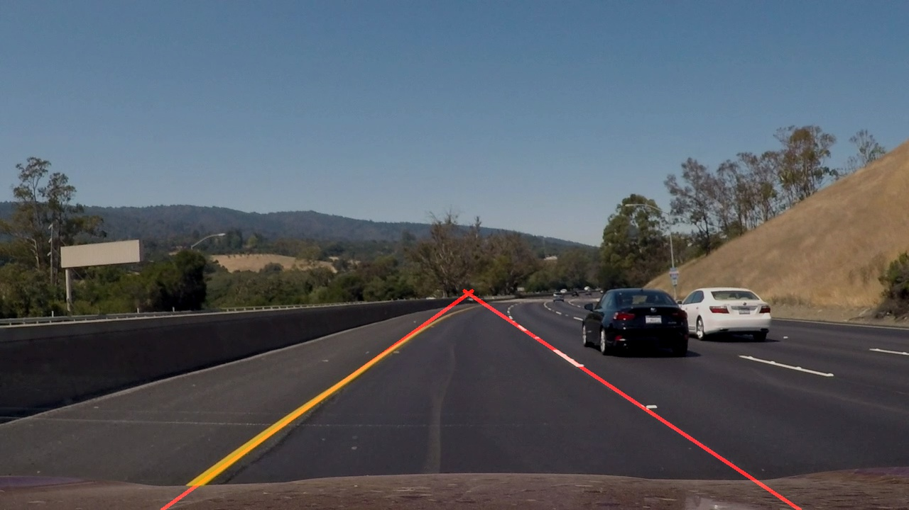
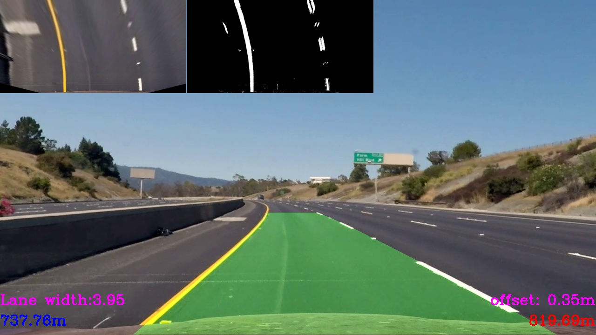
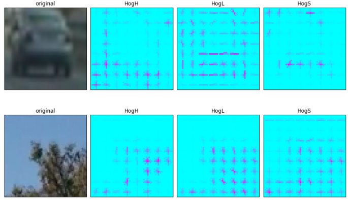
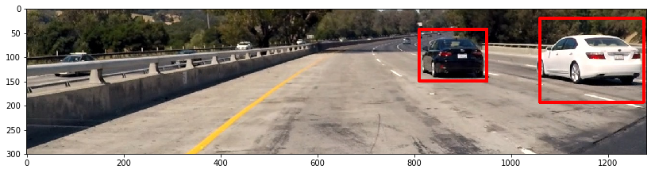

# Udacity SDND

## Project **Finding Lane Lines on the Road** 
https://github.com/maslovw/SDND/tree/master/FindingLanes

### Overview
When we drive, we use our eyes to decide where to go. 
The lines on the road that show us where the lanes are act as our constant 
reference for where to steer the vehicle. 
Naturally, one of the first things we would like to do in developing a 
self-driving car is to automatically detect lane lines using an algorithm.

In this project we will detect lane lines in images using Python3 and [OpenCV](http://opencv.org/).

## Project **Traffic Sign Recognition**
https://github.com/maslovw/SDND/tree/master/TrafficSignlassifier

### Overview
The goal of the project is to create a classificator for the German traffic sign data set.

In this project I tryed different classification models using Keras:
* LeNet
* LeNet on augmented data
* Inception
* Multi-column DNN

## Project **Advance Lane Lines on the Road** 
https://github.com/maslovw/SDND/tree/master/Advanced-Lane-Lines

## Project Vehicle Detection
https://github.com/maslovw/SDND/tree/master/VehicleDetection

The goals/steps of this project are the following:

* Perform a Histogram of Oriented Gradients (HOG) feature extraction on 
a labeled training set of images and train a classifier Linear SVM classifier
* Optionally, you can also apply a color transform and append binned color features, as
 well as histograms of color, to your HOG feature vector. 
* Note: for those first two steps don't forget to normalize your features and randomize a
 selection for training and testing.
* Implement a sliding-window technique and use your trained classifier to search for vehicles in images.
* Run your pipeline on a video stream (start with the test_video.mp4 and later 
 implement on full project_video.mp4) and create a heat map of recurring detections frame
 by frame to reject outliers and follow detected vehicles.
* Estimate a bounding box for vehicles detected.
